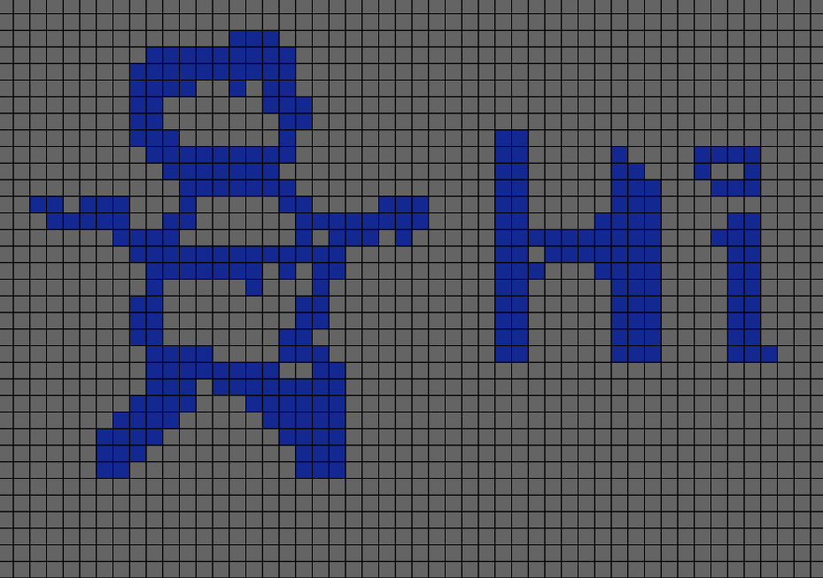
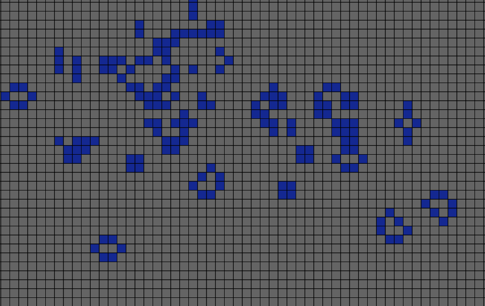
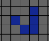
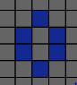
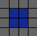
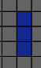
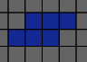
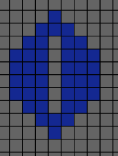

# :chipmunk: Game of Life

A visualizer for Conway's [Game of Life](https://en.wikipedia.org/wiki/Conway%27s_Game_of_Life). A Turing-Complete not-so-game 0-player game. Play now!!!

https://gameoflife-visualizer.herokuapp.com/

## Contribute
Please consider contributing to this project by adding some features that I listed below, or implement your own feature!

## :books: Rules
There is an arbitrarily-sized (or inifite) grid of cells that is either dead or alive. At the next cycle, each cell may change its livelihood based on these simple rules:

1. Any live cell with fewer than two live neighbours dies, as if by underpopulation;
2. Any live cell with two or three live neighbours lives on to the next generation;
3. Any live cell with more than three live neighbours dies, as if by overpopulation;
4. Any dead cell with exactly three live neighbours becomes a live cell, as if by reproduction.

[Source](https://en.wikipedia.org/wiki/Conway%27s_Game_of_Life)
## :star: Present Features
* Large 40 by 60 grid
* Quick and easy setup - *drag* to select multiple cells
* Dynamic addition of individual cells after the start of the simulation
* Pause button

## :soon: Coming Soon
* Colour, grid size, and board size **customization**
* Simulation update **frequency customization**
* Choice to start with well-studied, **cool patterns**
* Choice to **build your own circuit** using your Life, by including logic gates
* More **user-friendly design**!!
* Infinite universe option

## :brain: The Logics and Implmenetation
* This program uses a space-efficient, **in-place 2-bit state matrix** to store the current and next state (each one bit) at each iteration.
* Look at `JS/script.js` for details on the logic. The code is realtively thoroughly explained.
* The GUI was powered by the `P5.js` library, available [here](https://p5js.org/).
## :eyeglasses: Demo
Stay tuned for the live site, the best demo possible :)

Start of an amazing Life:

After a short while:

## :diamond_shape_with_a_dot_inside: Common Shapes
Eventually there will be a feature for common shapes to be selected at the start of a Life.
### :bow_and_arrow: Projectiles
Glider:

### :whale2: Still Lives
:bee: Beehive (lively stable):

:black_medium_square: Block (unstable):

### :infinity: Periodic Oscillators
:eyes: Blinker (period 2):

:frog: Toad (period 2):

:runner: Penta-Decathlon (period 15):

## :fleur_de_lis: Credits
Thank you Regis Zhao for giving me this cool idea. York Mills for life.

## :fax: Reach out
Got any cool ideas? Send me an e-mail! `qyw.wu@mail.utoronto.ca`
